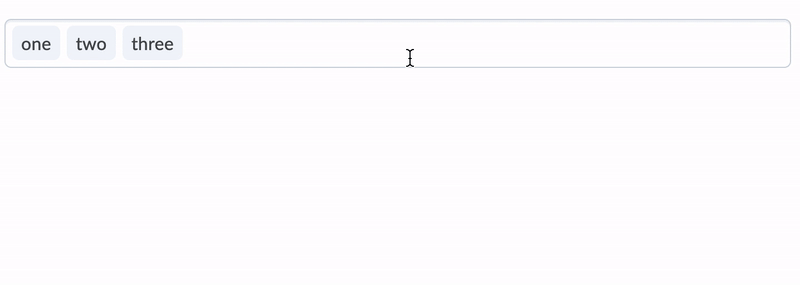

# d2l-labs-multi-select

[](https://www.npmjs.org/package/@brightspace-ui-labs/multi-select)

> Note: this is a ["labs" component](https://github.com/BrightspaceUI/guide/wiki/Component-Tiers). While functional, these tasks are prerequisites to promotion to BrightspaceUI "official" status:
>
> - [ ] [Design organization buy-in](https://github.com/BrightspaceUI/guide/wiki/Before-you-build#working-with-design)
> - [ ] [design.d2l entry](http://design.d2l/)
> - [ ] [Architectural sign-off](https://github.com/BrightspaceUI/guide/wiki/Before-you-build#web-component-architecture)
> - [x] [Continuous integration](https://github.com/BrightspaceUI/guide/wiki/Testing#testing-continuously-with-travis-ci)
> - [x] [Cross-browser testing](https://github.com/BrightspaceUI/guide/wiki/Testing#cross-browser-testing-with-sauce-labs)
> - [ ] [Unit tests](https://github.com/BrightspaceUI/guide/wiki/Testing#testing-with-polymer-test) (if applicable)
> - [ ] [Accessibility tests](https://github.com/BrightspaceUI/guide/wiki/Testing#automated-accessibility-testing-with-axe)
> - [ ] [Visual diff tests](https://github.com/BrightspaceUI/visual-diff)
> - [x] [Localization](https://github.com/BrightspaceUI/guide/wiki/Localization) with Serge (if applicable)
> - [x] Demo page
> - [x] README documentation

Polymer/Lit-based web component collection for D2L multi-select, creating, editing, and listing tags/attributes.


## Installation

```shell
npm install @brightspace-ui-labs/multi-select
```

## Components

### `d2l-labs-multi-select-input-text`

`d2l-labs-multi-select-input-text` includes a `d2l-input-text` that is hooked up to add items when 'Enter' is pressed.
**Usage:**
```html
<d2l-labs-multi-select-input-text>
	<d2l-labs-multi-select-list-item deletable text="Item 1"></d2l-labs-multi-select-list-item>
</d2l-labs-multi-select-input-text>
```

### `d2l-labs-multi-select-input`

You can use your own input component instead by putting it as a child of `d2l-labs-multi-select-input` and setting `slot="input"` on your input element. To add items to the list, call `addItem` with the item text.
**Usage:**
```html
<d2l-labs-multi-select-input id="multi-select-input">
	<div slot="input">
		<input>
		<button>Add</button>
	</div>
</d2l-labs-multi-select-input>
```

```js
button.addEventListener('click', () => {
	multiSelectInput.addItem(input.value)
})
```

### `d2l-labs-attribute-picker`

An autocompleting dropdown to choose one or more new or pre-existing attributes inline.
**Usage:**
```html
<script type="module">
    import '@brightspace-ui-labs/multi-select/attribute-picker.js';
</script>
<d2l-labs-attribute-picker>My element</d2l-labs-attribute-picker>
```

**Properties:**
| Property | Type | Description |
|--|--|--|
| allow-freeform | Boolean | When enabled, the user can manually type any attribute they wish. If false, they must select from the dropdown. |
| aria-label | String | Required. When true, the autocomplete dropdown will not be displayed to the user. |
| attribute-list | Array |  An array of string/value pairs representing the attributes currently selected in the picker (eg `[{"name":"shown to user","value":"sent in event"}]`). Only the values are sent in events and the string names are otherwise ignored. |
| assignable-attributes | Array | An array of string/value pairs, just like _attribute-list_, available in the dropdown list. |
| hide-dropdown | Boolean | When enabled, the autocomplete dropdown will not be displayed to the user. |
| limit | Number | The maximum length of attribute-list permitted. |

**Accessibility:**

To make your usage of `d2l-labs-attribute-picker` accessible, use the following properties when applicable:

| Attribute | Description |
|--|--|
| aria-label | The label should provide context for the attribute picker, such as type of attribute. |

**Events:**
The `d2l-labs-attribute-picker` dispatches the `d2l-attributes-changed` event each time an attribute has been added or removed. It will return the updated list of attributes:
```javascript
attributePicker.addEventListener('d2l-attributes-changed', (e) => {
  console.log(e.detail.attributeList.toString());
});
```

The `d2l-labs-attribute-picker` dispatches the `d2l-attribute-limit-reached` event when the user attempts to enter an attribute greater than the limit. This can be used to send feedback to the user.

## Deprecated Components

**The following components are deprecated. Use [`d2l-tag-list` and `d2l-tag-list-item`](https://github.com/BrightspaceUI/core/tree/main/components/tag-list) in `BrightspaceUI/core` instead.**

### `d2l-labs-multi-select-list-item`

`d2l-labs-multi-select-list-item` is a compact representation of information.

A `deletable` property can be set to enable the option of deleting the item, although there is no wire-up.
```html
<d2l-labs-multi-select-list-item deletable text="List item"></d2l-labs-multi-select-list-item>
```
A 'show-delete-hover-focus' property can be set to allow delete icon to show on hover or focus only.
```html
<d2l-labs-multi-select-list-item deletable show-delete-hover-focus text="List item"></d2l-labs-multi-select-list-item>
```
Also the following css variables are exposed to clients and can be use to override some of the appearance of the list item.
```html
--d2l-labs-multi-select-list-item-font
--d2l-labs-multi-select-list-item-padding
--d2l-labs-multi-select-list-item-padding-rtl
--d2l-labs-multi-select-list-item-padding-deletable
--d2l-labs-multi-select-list-item-padding-deletable-rtl
```

### `d2l-labs-multi-select-list`

`d2l-labs-multi-select-list` wraps a list of items, and provides spacing between the items, as well as keyboard navigation (arrow keys) and handling of item deletion (backspace/delete).

**Usage:**
```html
<d2l-labs-multi-select-list>
	<d2l-labs-multi-select-list-item text="List item 1"></d2l-labs-multi-select-list-item>
	<d2l-labs-multi-select-list-item text="List item 2"></d2l-labs-multi-select-list-item>
	...
</d2l-labs-multi-select-list>
```

You can opt for a condensed view by adding the `collapsable` attribute, which limits the element to the first line of items and provides a button for viewing the remaining items.

**Events:**

- `d2l-labs-multi-select-list-item-deleted`: fired on item deletion

- `d2l-labs-multi-select-list-item-added`: fired on item added to the `d2l-labs-multi-select-list`


## Developing, Testing and Contributing

After cloning the repo, run `npm install` to install dependencies.

Start a [@web/dev-server](https://modern-web.dev/docs/dev-server/overview/) that hosts the demo pages:

```shell
npm run start
```

To lint:

```shell
npm run lint
```

To run unit tests locally:

```shell
npm run test:headless
```

To lint AND run local unit tests:

```shell
npm run test
```

### Versioning and Releasing

This repo is configured to use `semantic-release`. Commits prefixed with `fix:` and `feat:` will trigger patch and minor releases when merged to `main`.

To learn how to create major releases and release from maintenance branches, refer to the [semantic-release GitHub Action](https://github.com/BrightspaceUI/actions/tree/main/semantic-release) documentation.
